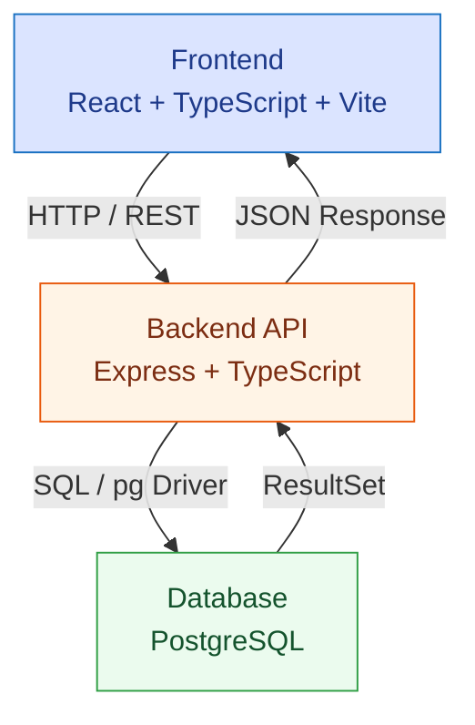
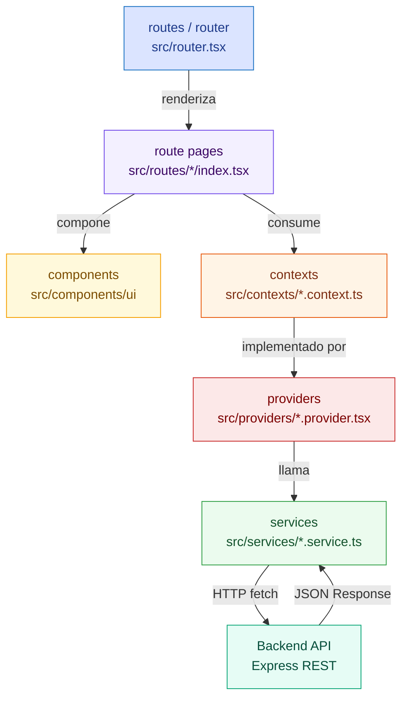
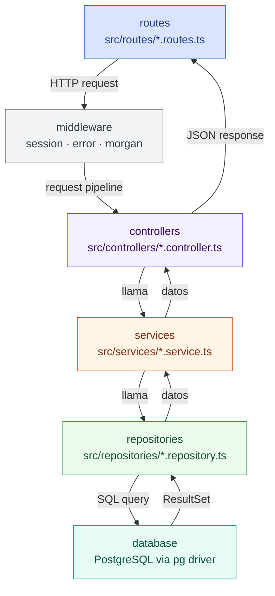

# Diagramas de Flujo de Datos — FullStock

---

## 1. Flujo de datos de alto nivel

```mermaid
flowchart TD
    FE["Frontend\nReact + TypeScript + Vite"]
    BE["Backend API\nExpress + TypeScript"]
    DB["Database\nPostgreSQL"]

    FE -->|"HTTP / REST"| BE
    BE -->|"SQL / pg Driver"| DB
    DB -->|"ResultSet"| BE
    BE -->|"JSON Response"| FE

    classDef frontend fill:#dbe4ff,stroke:#1971c2,color:#1e3a8a
    classDef backend  fill:#fff4e6,stroke:#e8590c,color:#7c2d12
    classDef database fill:#ebfbee,stroke:#2f9e44,color:#14532d

    class FE frontend
    class BE backend
    class DB database
```

---

## 2. Flujo de datos en el frontend

```mermaid
flowchart TD
    R["routes / router\nsrc/router.tsx"]
    RP["route pages\nsrc/routes/*/index.tsx"]
    CO["components\nsrc/components/ui"]
    CT["contexts\nsrc/contexts/*.context.ts"]
    PR["providers\nsrc/providers/*.provider.tsx"]
    SV["services\nsrc/services/*.service.ts"]
    BE["Backend API\nExpress REST"]

    R  -->|"renderiza"| RP
    RP -->|"compone"| CO
    RP -->|"consume"| CT
    CT -->|"implementado por"| PR
    PR -->|"llama"| SV
    SV -->|"HTTP fetch"| BE
    BE -->|"JSON Response"| SV

    classDef router   fill:#dbe4ff,stroke:#1971c2,color:#1e3a8a
    classDef page     fill:#f3f0ff,stroke:#7048e8,color:#3b0764
    classDef comp     fill:#fff9db,stroke:#f59f00,color:#7c4d00
    classDef ctx      fill:#fff4e6,stroke:#e8590c,color:#7c2d12
    classDef prov     fill:#fce8e8,stroke:#c92a2a,color:#7c0000
    classDef svc      fill:#ebfbee,stroke:#2f9e44,color:#14532d
    classDef backend  fill:#e6fcf5,stroke:#0ca678,color:#064e3b

    class R router
    class RP page
    class CO comp
    class CT ctx
    class PR prov
    class SV svc
    class BE backend
```

---

## 3. Flujo de datos en el backend

```mermaid
flowchart TD
    RO["routes\nsrc/routes/*.routes.ts"]
    MW["middleware\nsession · error · morgan"]
    CT["controllers\nsrc/controllers/*.controller.ts"]
    SV["services\nsrc/services/*.service.ts"]
    RP["repositories\nsrc/repositories/*.repository.ts"]
    DB["database\nPostgreSQL via pg driver"]

    RO -->|"HTTP request"| MW
    MW -->|"request pipeline"| CT
    CT -->|"llama"| SV
    SV -->|"llama"| RP
    RP -->|"SQL query"| DB
    DB -->|"ResultSet"| RP
    RP -->|"datos"| SV
    SV -->|"datos"| CT
    CT -->|"JSON response"| RO

    classDef routes  fill:#dbe4ff,stroke:#1971c2,color:#1e3a8a
    classDef mw      fill:#f1f3f5,stroke:#868e96,color:#343a40
    classDef ctrl    fill:#f3f0ff,stroke:#7048e8,color:#3b0764
    classDef svc     fill:#fff4e6,stroke:#e8590c,color:#7c2d12
    classDef repo    fill:#ebfbee,stroke:#2f9e44,color:#14532d
    classDef db      fill:#e6fcf5,stroke:#0ca678,color:#064e3b

    class RO routes
    class MW mw
    class CT ctrl
    class SV svc
    class RP repo
    class DB db
```
